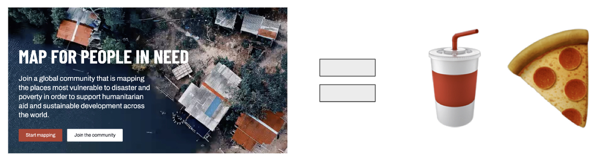
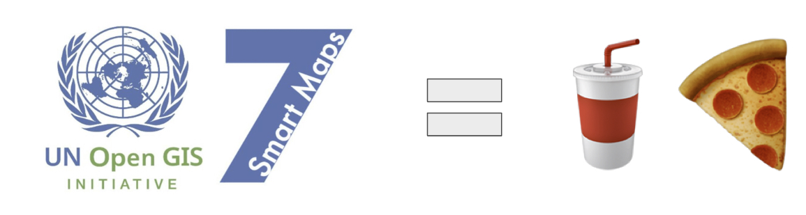
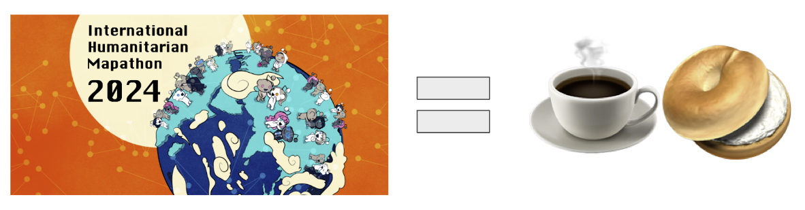

# Challenge 01 2024 International Humanitarian mapathon

## Day 1: Wednesday April 24 3pm

Links: 

- [Tasking Manager](https://tasks.hotosm.org/)
- [LearnOSM](https://learnosm.org/en/)
- [OpenStreetMap](https://www.openstreetmap.org/)
- [Mapillary](https://www.mapillary.com/)
- [MapSwipe](https://mapswipe.org/)
- [Field Papers](http://fieldpapers.org/)

<!-- 
These step-by-step instructions help you to get started mapping with the Tasking Manager on OpenStreetMap.
 -->

これらの段階的な手順は、OpenStreetMap で Tasking Manager を使用してマッピングを開始するのに役立ちます。

<!-- 
Do you have an OpenStreetMap account already? You can skip ahead to step 4.
 -->

すでに OpenStreetMap アカウントをお持ちですか？ステップ 4 に進むことができます。

<!-- 
1.Click on the Sign up button in the upper right corner of the <a class="link red fw5" href="/">Tasking Manager</a> homepage. -->

Tasking Manager のホームページの右上隅にある Sign up ボタンをクリックします。

	

<!-- 
2.Provide your name and email address. We will use this information to guide you through the sign-up process. -->

名前とメールアドレスを入力します。この情報を使用して、サインアッププロセスを案内します。

	

<!-- 
3.A new tab will open allowing you to register on OpenStreetMap.org. Provide your account information and press the Sign up button at the bottom of the form. -->

OpenStreetMap.org に登録するための新しいタブが開きます。アカウント情報を入力し、フォームの下にある Sign up ボタンを押します。

	

<!-- 
4.Close the tab and go back to the <a class="link red fw5" href="/">Tasking Manager</a>. Click the button to Log in. -->

タブを閉じて、<a class="link red fw5" href="/">Tasking Manager</a> に戻ります。 Log in ボタンをクリックします。

	

<!-- 
5.Select Explore projects in the main navigation to find a project to help map. Or use the link provided by your mapathon instructor. -->

メインナビゲーションで Explore projects を選択して、マッピングを手伝うプロジェクトを見つけます。または、マッピングマラソンのインストラクターから提供されたリンクを使用します。
    
	

<!-- 
6.Read the introduction to the project and click on Contribute to begin with a mapping task. -->

プロジェクトの紹介を読んで、Contribute をクリックしてマッピングタスクを開始します。

	
	

<!-- 
7.Map a randomly selected task for mapping by clicking on the button Map a task. -->

ランダムに選択されたマッピングタスクをマッピングするには、Map a task ボタンをクリックします。

	

	
	<!-- 
Alternatively, you can also select one from the  map or the task and choose “Map selected task”.

 -->
	
または、マップまたはタスクから 1 つを選択し、「Map selected task」を選択することもできます。

<!-- 
8.This opens the editor; map all the features asked for in the instructions. -->

これによりエディタが開き、指示に従ってすべての機能をマッピングします。
   
	

	
	<!-- 
For more information on mapping in OpenStreetMap please have a look at our tutorials on the <a class="link red fw5" href="/learn/map">Learn pages</a>.

 -->
	
OpenStreetMap でのマッピングについての詳細は、<a class="link red fw5" href="/learn/map">Learn pages</a> のチュートリアルをご覧ください。

<!-- 
9.When finished mapping, save your edits and select the button Submit task. -->

マッピングが終了したら、編集を保存し、Submit task ボタンを選択します。
    
	

	
	<!-- 
After this, you can go back to step 7 and select a new task for mapping. Thank you for your contribution to OpenStreetMap!

 -->
	
これで、ステップ 7 に戻ってマッピングの新しいタスクを選択できます。OpenStreetMap への貢献ありがとうございます！

## Day 2: Thursday April 25 3pm

Links to Humanitarian Organizations:

- [UNOCHA](https://www.unocha.org/)
- [UNHCR](https://www.unhcr.org/)
- [UNICEF](https://www.unicef.org/)
- [WFP](https://www.wfp.org/)
- [WHO](https://www.who.int/)
- [World Bank](https://www.worldbank.org/)
- [Red Cross](https://www.icrc.org/)
- [MSF](https://www.msf.org/)

Links to humanitarian open data:

- [HDX](https://data.humdata.org/)
- [World Bank](https://data.worldbank.org/)
- [UNICEF](https://data.unicef.org/)

Links to open source mapping tools:

- [Kepler](https://kepler.gl/)
- [QGIS](https://qgis.org/)
- [Mapbox](https://www.mapbox.com/)
- [Leaflet](https://leafletjs.com/)
- [OpenLayers](https://openlayers.org/)
- [Tangram](https://tangrams.github.io/)
- [Turf.js](http://turfjs.org/)
- [Leafmap](https://leafmap.org/)

UN チームはハッカソンのためのデータパッケージを提供します。ハッカソンが始まるまで参加者には内容がわかりません！

プロンプト：関係を理解し、視覚化し、物語を構築する

提出物：データ可視化コンポーネント（地図、チャートなど）が必要です

期限：地図の提出期限は 3 日目のセッションが始まる時点です。

## Day 3: Friday April 26 10am

Links:

- [Youth Mappers](https://www.youthmappers.org/)
- [Reitaku University](https://www.reitaku-u.ac.jp/)
- [UCLA](https://www.ucla.edu/)
- [USC](https://www.usc.edu/)
- [Aoyama Gakuin University](https://www.aoyama.ac.jp/)
- [University of Hawaii](https://www.hawaii.edu/)
- [Centro Geo Mexico](https://www.centrogeo.edu.mx/)

Agenda:

- 各地域のライトニングプレゼンテーションの概要
- 国際的なミートアップ
	- 異なる地域からの4-5人で30-45分のブレイクアウトルーム
	- プロンプト：
		- アイスブレーカー
			- アイスクリーム
			- 地図？
			- 今日何を食べましたか
			- お気に入りのフレンチフライのスタイル
			- お気に入りの食べ物/料理
		- 自己紹介
		- InstagramやWhatsAppを共有する
		- このマップアソンに参加した経験を共有する
		- 作成した地図と得られた教訓を共有する

- 🏆 マップアワード
	- UNグループからのパネル審査
	- Padletを通じたピープルズチョイスアワード

