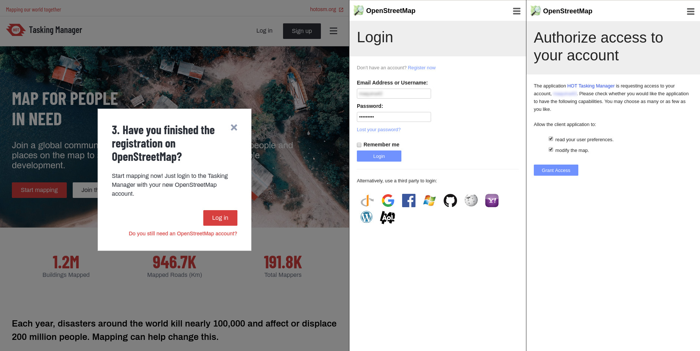
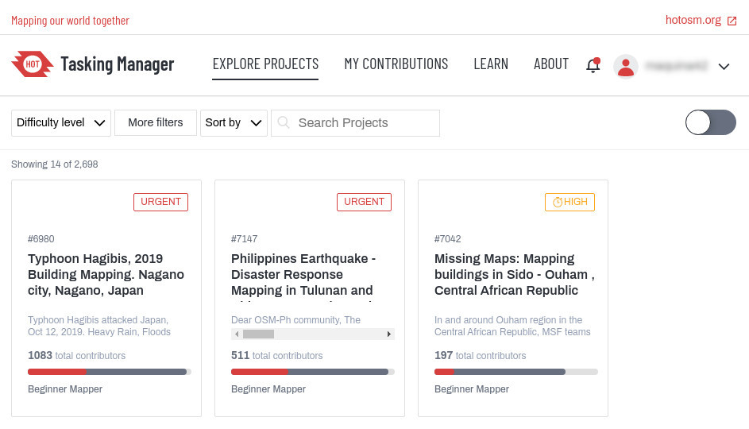

## April 17

These step-by-step instructions help you to get started mapping with the Tasking Manager on OpenStreetMap.

Do you have an OpenStreetMap account already? You can skip ahead to step 4.

1.Click on the Sign up button in the upper right corner of the <a class="link red fw5" href="/">Tasking Manager</a> homepage.

2.Provide your name and email address. We will use this information to guide you through the sign-up process.

3.A new tab will open allowing you to register on OpenStreetMap.org. Provide your account information and press the Sign up button at the bottom of the form.

4.Close the tab and go back to the <a class="link red fw5" href="/">Tasking Manager</a>. Click the button to Log in.

5.Select Explore projects in the main navigation to find a project to help map. Or use the link provided by your mapathon instructor.

6.Read the introduction to the project and click on Contribute to begin with a mapping task.

7.Map a randomly selected task for mapping by clicking on the button Map a task.

Alternatively, you can also select one from the  map or the task and choose “Map selected task”.

8.This opens the editor; map all the features asked for in the instructions.

For more information on mapping in OpenStreetMap please have a look at our tutorials on the <a class="link red fw5" href="/learn/map">Learn pages</a>.

9.When finished mapping, save your edits and select the button Submit task.

After this, you can go back to step 7 and select a new task for mapping. Thank you for your contribution to OpenStreetMap!

