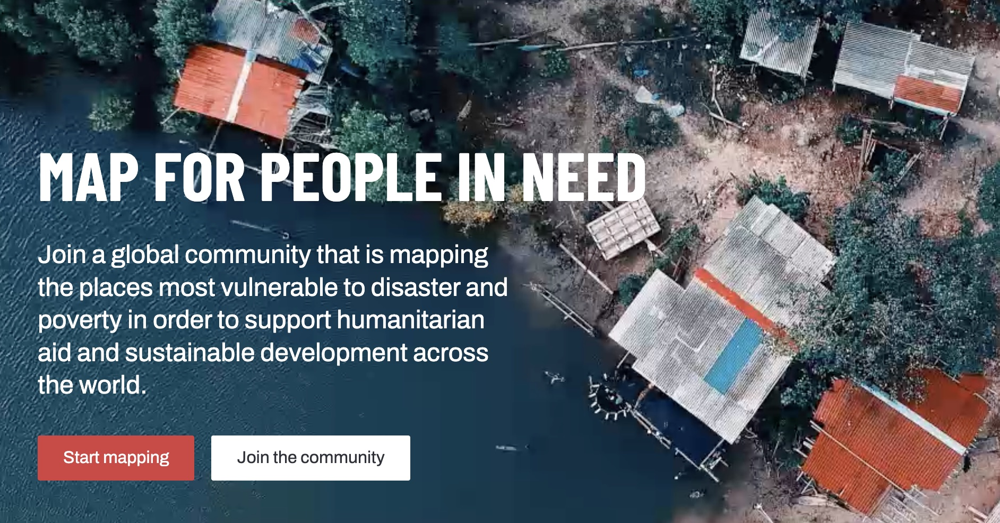
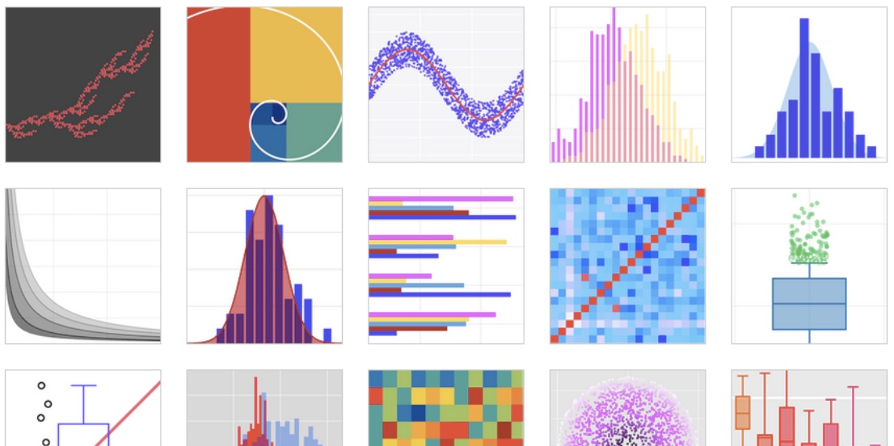
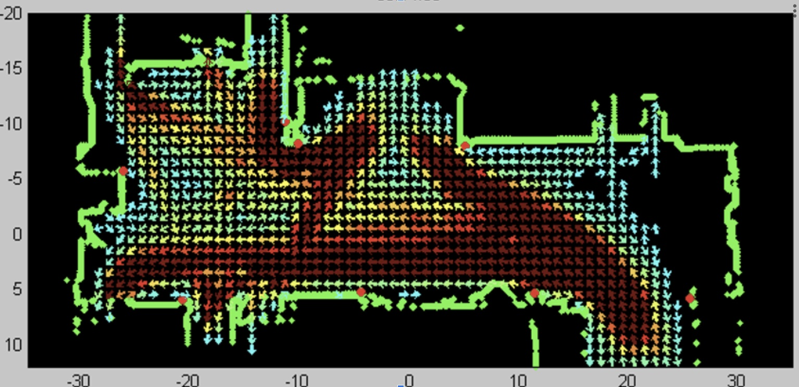

---
hide:
    - toc
---

# iStudio データチャレンジ Series

みんなで様々な角度から
データに触れ、色々と試し
てみながら、新たな「発
見」をしましょう！
全く経験のないビギナー
から、プログラミング大好
きというエキスパートまで、
どんなレベルの学生でも
大丈夫！ 1 回完結型なの
で、興味のある回に参加し
てください！

## データチャレンジ 1: Crisis Map Challenge
April 24, 2024 

★☆☆

<a href="Challenge 01" class="btn">Start the challenge →</a>

## データチャレンジ 2: GitHub Challenge
May 8, 2024

★☆☆

<a href="Challenge 02.md" class="btn">Start the challenge →</a>

## データチャレンジ 3: Website Challenge
May 15, 2024

★☆☆

<a href="Challenge 03.md" class="btn">Start the challenge →</a>

## データチャレンジ 4: Python Setup Challenge
May 22, 2024

★☆☆

<a href="Challenge 04.md" class="btn">Start the challenge →</a>

## データチャレンジ 5: Python Chart Challenge
May 29, 2024

★★☆

<a href="Challenge 05.md" class="btn">Start the challenge →</a>

## データチャレンジ 6: Data Viz Challenge
June 5, 2024

★★☆ 

<a href="Challenge 06.md" class="btn">Start the challenge →</a>

## データチャレンジ 7: 

