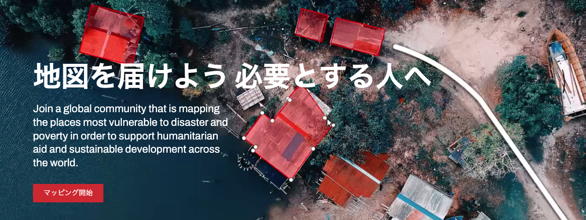
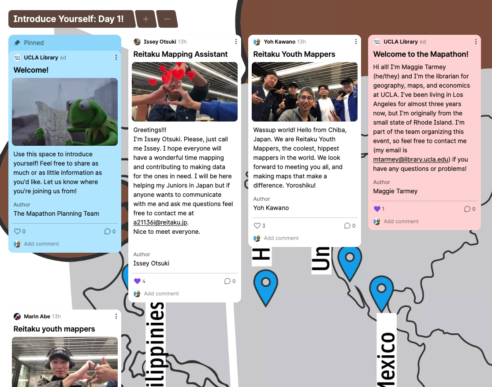

# Day 1: Wednesday April 24 3pm

## まずは「Padlet」で自己紹介！

[Padlet](https://padlet.com/UCLA_Library/international-humanitarian-mapathon-2024-v9xzbflkecfhwugp)

## スタートはここから：

- [Quick start guide](https://tasks.hotosm.org/learn/quickstart)

## タスキングマネージャーのつかいかた2020 

<iframe width="560" height="315" src="https://www.youtube.com/embed/DBgWSsp53Ps?si=5Y-vmZTcGGaW9UI6" title="YouTube video player" frameborder="0" allow="accelerometer; autoplay; clipboard-write; encrypted-media; gyroscope; picture-in-picture; web-share" referrerpolicy="strict-origin-when-cross-origin" allowfullscreen></iframe>

## 大学1年生から見た初心者のための使い方

<iframe width="560" height="315" src="https://www.youtube.com/embed/eZgBbJ-Mje0?si=3stp_jDZU_Ej7Cf_" title="YouTube video player" frameborder="0" allow="accelerometer; autoplay; clipboard-write; encrypted-media; gyroscope; picture-in-picture; web-share" referrerpolicy="strict-origin-when-cross-origin" allowfullscreen></iframe>

